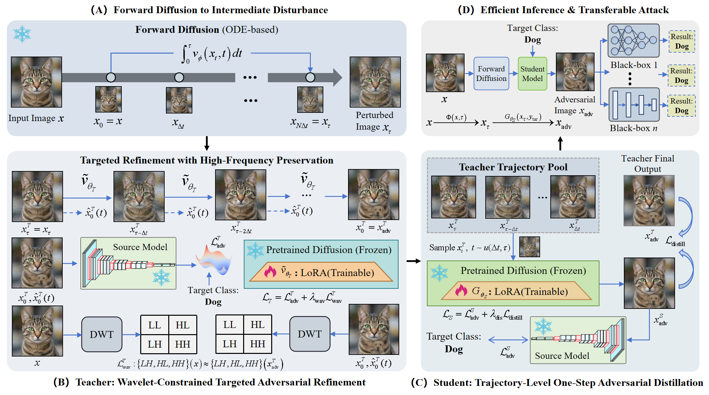

# 📰 WCTD: Wavelet-Constrained Trajectory Distillation for Efficient Transferable Targeted Attacks

<div align="center">

[](https://github.com/xuejianhuang/WCTD)
[](LICENSE)
[](https://www.python.org/)
[](https://pytorch.org/)

</div>

This repository contains the official implementation of the paper **WCTD**, a novel method for generating **targeted transferable adversarial examples** using a teacher–student distillation framework with wavelet-guided refinement.

---

## 🎯 Key Features

- ⚡ **Efficient**: Single-step generation via student network
- 🎨 **Imperceptible**: Wavelet-constrained perturbations
- 🔄 **Transferable**: Works across CNN, Transformer, and MLP architectures
- 🎯 **Targeted**: Precise class-specific attacks

---

## 📌 Method Overview

WCTD generates high-quality targeted adversarial examples through a teacher–student distillation framework:

| Component | Role |
|-----------|------|
| **Teacher** | Performs target-aware iterative refinement with wavelet-guided detail preservation |
| **Student** | Learns to reproduce the teacher's refinement process in a **single forward step** |

This design achieves an optimal balance between **attack success rate**, **transferability**, and **computational efficiency**, while keeping perturbations visually imperceptible.

<div align="center">
  
  <br>
  <em>Figure 1: Overall architecture of WCTD teacher-student distillation framework.</em>
</div>

---

## 📂 Datasets

| Dataset | Usage | Link | Notes |
|---------|-------|------|-------|
| **ImageNet** | Training | [Download](https://image-net.org/download.php) | Full training set |
| **ImageNet-NeurIPS** | Testing | [Kaggle](https://www.kaggle.com/c/nips-2017-non-targeted-adversarial-attack) | Standard adversarial benchmark |
| **MSCOCO val2017** | Testing   | [Download](http://images.cocodataset.org/zips/val2017.zip) | Cross-domain evaluation |

---

## 🧠 Victim Models

We evaluate WCTD against a diverse set of victim models spanning multiple architectures:

<details>
<summary><b>CNN-based Models (7)</b></summary>

- Inception-v3
- ResNet-152
- DenseNet-121
- GoogleNet
- VGG-16
- Inception-ResNet-v2
- Inception-v4
</details>

<details>
<summary><b>Transformer-based Models (4)</b></summary>

- ViT-B/16
- DeiT-B
- Swin-T
- Swin-B
</details>

<details>
<summary><b>MLP-based Models (3)</b></summary>

- CycleMLP
- Mixer-B/16
- Mixer-L/16
</details>

<details>
<summary><b>Diffusion-based Models (1)</b></summary>

- Stable Diffusion v1-5
</details>

🔗 **Model checkpoints**: See [original documentation](#) for download links.

---

## 🧪 Surrogate Models

Surrogate models used for attack generation:

| Category | Models |
|----------|--------|
| **CNN** | Inception-v3, ResNet-152 |
| **Transformer** | Swin-T, DeiT-B |
| **MLP** | CycleMLP, Mixer-B/16 |

---

## ⚙️ Baseline Methods

We compare WCTD against state-of-the-art targeted attack methods:

| Category | Methods |
|----------|---------|
| **Optimization-based** | Logit, SU |
| **Generator-based** | C-GSP, CGNC |
| **Diffusion / Flow-based** | DiffAttack, TGAF, Dual_Flow |

---

## 📁 Project Structure


```
├── data/
│   ├── imagenet/
│   │   └── train/
│   │       ├── n01749939/
│   │       │   ├── n01749939_10126.JPEG
│   │       │   └── ...
│   │       └── ...
│   ├── imagenet-nips-val/
│   │   ├── categories.csv
│   │   ├── images.csv
│   │   └── images/
│   │       ├── 000b7d55b6184b08.png
│   │       └── ...
│   └── MSCOCO/ (optional)
│       └── val2017/
│           ├── 000000000139.jpg
│           └── ...
├── downloaded_pretrain_models/
│   ├── scheduler/
│   ├── text_encoder/
│   ├── tokenizer/
│   ├── unet/
│   └── vae/
├── imagenet_class_index.json
└── test_model/
    ├── Cycle_mlp/
    │   ├── CycleMLP_B5.pth
    │   └── cyclemlp.py
    └── other_models/
```

---

## 🛠️ Environment Setup

### Prerequisites
- Python 3.8+
- CUDA 11.3+ (recommended for GPU acceleration)

### Installation

```bash
# Clone the repository
git clone https://github.com/xuejianhuang/WCTD.git
cd WCTD

# Create virtual environment
python -m venv WCTD_env

# Activate environment
# Windows:
WCTD_env\Scripts\activate
# macOS/Linux:
source WCTD_env/bin/activate

# Install dependencies
pip install -r requirements.txt

```

## 🚀 Training

### Teacher Training

```bash
python teacher_train.py \
  --pretrained_model_name_or_path="downloaded_pretrain_models" \
  --dataset_dir="/path/to/imagenet/train" \
  --output_root="/path/to/output" \
  --model_type=res152 \
  --attack_mode=multi_targeted \
  --train_batch_size=4 \
  --num_train_epochs=10 \
  --learning_rate=1e-04 \
  --seed=42
```

### Student Training

```bash
python student_train.py \
  --pretrained_model_name_or_path="downloaded_pretrain_models" \
  --dataset_dir="/path/to/imagenet/train" \
  --output_root="/path/to/output" \
  --model_type=res152 \
  --attack_mode=multi_targeted \
  --train_batch_size=4 \
  --num_train_epochs=10 \
  --learning_rate=1e-04 \
  --seed=42
```

## 🧪 Generating Adversarial Examples

```bash
python eval.py \
  --pretrained_model_name_or_path="downloaded_pretrain_models" \
  --dataset_dir="/data/imagenet-nips-val" \
  --student_lora_path="/output/final_model" \
  --save_dir="/output/eval_results" \
  --model_type=res152 \
  --attack_mode=multi_targeted \
  --test_batch_size=8 \
  --eps=16 \
  --seed=42
```
## 🛡️ Test Robust Models

### Single Robust Model Test

```bash
python inference.py \
  --test_dir="/path/to/imagenet-nips-val" \
  --batch_size=8 \
  --model_type=robust
```
### All Robust Models Test

```bash
python inference.py \
  --test_dir="/data/imagenet-nips-val" \
  --model_type=all
```

## 🙏 Acknowledgements
We sincerely thank the following researchers for their valuable contributions:
*  Yixiao Chen (Tsinghua University, Beijing, China)
*  Shikun Sun (Tsinghua University, Beijing, China)
*  Hao Fang (Tsinghua University, Beijing, China)
*  Jianqi Chen (Beihang University, Beijing, China)
*  Zhenwei Shi (Beihang University, Beijing, China)
*  Hangyu Liu (Zhejiang University, Hangzhou, China)

## 📧 Contact
For questions or collaboration opportunities, please open an issue or contact the authors directly.
